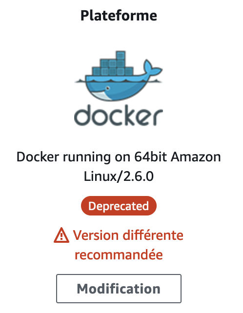
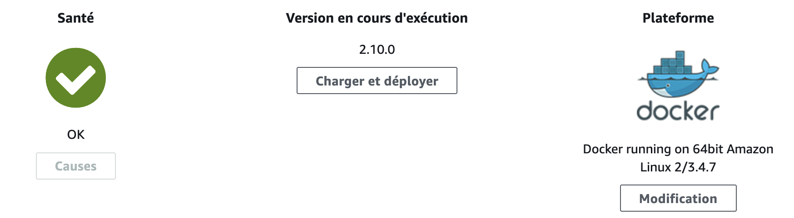

Dans cet article je vais revenir sur la migration d'une application déployée sur [Elastic Beanstalk](https://aws.amazon.com/fr/elasticbeanstalk/) Amazon Linux/Docker vers la nouvelle plateforme **Amazon Linux 2/Docker**.

## Plateforme

Cette migration fait suite à l'inscription de la plateforme actuellement utilisée (*Docker running on 64bit Amazon Linux/2.6.0*) pour déployer l'application concernée sur la liste des [platform versions scheduled for retirement](https://docs.aws.amazon.com/elasticbeanstalk/latest/platforms/platforms-retiring.html#platforms-retiring.docker).




A une version de plateforme Elastic Beanstlak correspondent une version d'AMI, une version de Docker et une version de serveur nginx dont on peut retrouver le détail sur [cette page pour les anciennes versions](https://docs.aws.amazon.com/elasticbeanstalk/latest/platforms/platform-history-docker-legacy.html).

On constate donc que notre plateforme Docker Amazon Linux 2.6.0 utilise :
- l'AMI Amazon Linux 2017.03.0
- Docker 1.12.6
- nginx 1.10.2

Le passage à une version plus récente de la plateforme va donc mettre à jour l'ensemble de ces composants. Lors de la réalisation de la migration, [la version la plus récente](https://docs.aws.amazon.com/elasticbeanstalk/latest/platforms/platforms-supported.html#platforms-supported.docker) de la plateforme Amazon Linux 2/Docker est la 3.4.7 qui correspond aux composants suivants :
- AMI Amazon Linux 2.0.20210813
- Docker 20.10.7-3
- Docker Compose 1.29.2
- nginx 1.20.0

Notez au passage que Docker Compose a fait son apparition, je reviendrai sur le sujet ultérieurement dans l'article.

Pour réaliser la migration, il sera donc nécessaire que l'application soit compatible avec l'ensemble des composants de la plateforme mise à jour.

## Déploiement

L'interface d'Elastic Beanstalk propose certes un bouton "Modification" au niveau du cartouche Plateforme mais ce bouton ne permet le passage des plateformes Amazon Linux vers Amazon Linux 2. Il permet uniquement de passer vers une version plus récente de la plateforme Amazon Linux/Docker. Cette option ne nous intéresse pas ici, car même les versions plus récentes des plateformes Amazon Linux/Docker sont dépréciées.

Dans ce cas il est nécessaire de procéder à un [blue/green deployement](https://docs.aws.amazon.com/elasticbeanstalk/latest/dg/using-features.CNAMESwap.html) c'est à dire :
- déployer un nouvel environnement avec la plateforme Amazon Linux 2/Docker
- procéder à un "swap" d'URL entre le nouvel environnement et l'ancien, lorsque le nouvel environnement est opérationnel.

## Migration

### Docker

La première étape de la migration consiste donc à vérifier que notre application est  compatible avec la version de Docker 20.10.7-3. La construction de l'image avec le Dockerfile et le déploiement du conteneur se passent sans problème ; aucune adaptation n'est nécessaire à ce niveau là.

### Amazon Linux 2

La vérification de la compatibilité de l'application avec la nouvelle version de Docker étant faite, il s'agit à présent de migrer l'application afin d'être compatible avec la plateforme Amazon Linux 2.

AWS propose un [guide de migration](https://docs.aws.amazon.com/elasticbeanstalk/latest/dg/using-features.migration-al.html) pour préparer la mise à jour. D'après cette documentation, les changements à prévoir dans notre cas sont les suivants :

- déplacement des fichiers de personnalisation de la configuration nginx depuis `.ebextensions/nginx` vers `.platform/nginx`
- mettre à jour l'un de nos scripts .ebextensions qui utilise le mécanisme de [Custom platform hooks](https://docs.aws.amazon.com/elasticbeanstalk/latest/dg/custom-platform-hooks.html) pour utiliser [les nouveaux mécanismes](https://docs.aws.amazon.com/elasticbeanstalk/latest/dg/platforms-linux-extend.html) d'extension des plateformes Linux Elastic Beanstalk 

Rien de bien méchant sur le papier, toutefois on se retrouve assez vite confrontés à des erreurs dans les scripts .ebxtensions :

    /bin/sh: initctl: command not found

En effet, Amazon Linux 2 [n'utilise plus Upstart mais SystemD](https://serverfault.com/questions/974425/where-should-init-scripts-be-placed-in-amazon-linux-2). Des adaptations de ces scripts sont donc à prévoir.

### Ports mutliples

Mais avant de poursuivre et d'adapter les extensions concernées nous réalisons que ces scripts avaient pour objectif de customiser la plateforme afin de permettre à notre application d'être accessible sur deux ports : le port pour servir l'application et un port spécifique pour permettre la connection à distance d'un debugger JVM.

En effet, Elastic Beanstalk utilise une configuration standard du reverse proxy nginx qui utilise le port déclaré dans la directive `EXPOSE` du Dockerfile auquel il transmet les requêtes reçues. Si plusieurs ports sont déclarés dans cette directive, seul le premier est "lié" à nginx et les autres ports restent inacessibles sur l'instance ec2.

Pour rendre ce deuxième port accessible il avait été nécessaire de [bypasser nginx](https://forums.aws.amazon.com/message.jspa?messageID=621475) avec  [des tweaks peu élégants](https://forums.aws.amazon.com/thread.jspa?messageID=605895#605895) de la configuration d'iptables.

### Docker Compose

Or il se trouve que la nouvelle plateforme Amazon Linux 2/Docker introduit une nouveauté particulièrement intéressante : la possibilité d'utiliser Docker Compose pour décrire les services à démarrer.

> **Attention** il existait déjà une option sur Elastic Beanstalk pour gérer des [environnements Docker multi-containers avec Amazon Linux](https://docs.aws.amazon.com/elasticbeanstalk/latest/dg/create_deploy_docker_ecs.html)  via l'utilisation d'un fichier `Dockerrun.aws.json`. La co-existence de documentation relative à cette ancienne approche et la plateforme Amazon Linux 2 avec ou sans Docker Compose sur le site de documentation d'AWS rend les choses parfois un peu confuses, il faut bien faire attention à la plateforme à laquelle s'appliquent les différentes documentations et dans le cas Amazon Linux 2, des éléments spécifiques à l'utilisation de Docker Compose. Les différences entre le multi-container sur Amazon Linux et Docker Compose sur Amazon Linux 2 [sont résumées ici](https://docs.aws.amazon.com/elasticbeanstalk/latest/dg/docker-multicontainer-migration.html).

Dans ce cas, le reverse proxy nginx n'est pas géré par Elastic Beanstalk et c'est à l'utilisateur de déclarer et configurer le reverse proxy, ce qui offre beaucoup plus de possibilités de personnalisation.

Nous ajoutons donc un fichier `docker-compose.yml`à notre projet qui permet à Elastic Beanstalk d'utiliser le [Multi container platform](https://docs.aws.amazon.com/elasticbeanstalk/latest/dg/create_deploy_docker_ecs.html) avec Docker Compose.

```yml
version: "3.9"
services:
    my-app:
        build: .
        ports:
            - "9000:9000"
            - "5005:5005"
        env_file:
            - .env
        container_name: "my-app"
    nginx-proxy:
        image: "nginx"
        ports:
            - "80:80"
            - "443:443"
        volumes:
            - "./nginx/nginx.conf:/etc/nginx/nginx.conf:ro"
        links:
            - "my-app"
```

Cette configuration permet donc de démarrer deux containers :
- le container qui contient notre application "my-app" qui expose les ports 9000 et 5005
- le container qui contient le reverse proxy nginx

Le reverse proxy nginx utilise l'image officielle nginx. La configuration est fournie via la définition d'un volume : `"./nginx/nginx.conf:/etc/nginx/nginx.conf:ro"`

Le fichier `./nginx/nginx.conf` (simplifié) ci-dessous permet ensuite de définir la configuration du reverse proxy pour gérer les différents ports :

```
events {

}

http {
    log_format healthd '$msec"$uri"'
              '$status"$request_time"$upstream_response_time"'
              '$http_x_forwarded_for';

    map $http_upgrade $connection_upgrade {
        default       "upgrade";
        ""            "";
    }

    server {
      listen 80;
      client_max_body_size 2G;
      
      location / {
        proxy_pass            http://my-app:9000;
        proxy_http_version    1.1;
        proxy_set_header    Connection            $connection_upgrade;
        proxy_set_header    Upgrade                $http_upgrade;
        proxy_set_header    Host                $host;
        proxy_set_header    X-Real-IP            $remote_addr;
        proxy_set_header    X-Forwarded-For        $proxy_add_x_forwarded_for;
        proxy_connect_timeout       60;
        proxy_send_timeout          300;
        proxy_read_timeout          300;
      }
    }

    server {
      listen 5005;

      location / {
        proxy_pass http://my-app:5005;
        proxy_http_version    1.1;
        proxy_set_header    Connection            $connection_upgrade;
        proxy_set_header    Upgrade                $http_upgrade;
        proxy_set_header    Host                $host;
        proxy_set_header    X-Real-IP            $remote_addr;
        proxy_set_header    X-Forwarded-For        $proxy_add_x_forwarded_for;
      }
    }
}

```

Ce fichier permet :
- de re-diriger les requêtes arrivant sur le port 80 vers le port 9000 du container de notre application
- de re-diriger les requêtes arrivant sur le port 5005 vers le port 5005 du container de notre application

Notez au passage que Docker Compose permet de définir localement des noms de domaines correspondant au nom des containers ce qui permet de les identifier facilement dans la configuration nginx par exemple : `http://my-app:9000`

Ce passage à Docker Compose nous a permis de simplifier notablement la configuration précédente et de supprimer plusieurs scripts de personnalisation dans .ebextensions qui ne nécessitent donc plus d'être migrés.

Nous avons toutefois été confrontés à quelques subtilités de configurations liés notamment aux logs nginx. En effet, le reverse proxy de nginx n'étant pas géré automatiquement par Elastic Beanstalk, il est nécessaire de prendre soin de bien paramétrer les logs de notre container nginx.

Elastic Beanstalk accède en effet aux logs de nginx pour deux raisons :
- la récupération des journaux d'une instance
- le suivi de santé amélioré des instances

### Récupération des journaux

Elastic Beanstalk permet de télécharger facilement les logs d'un environnement. Pour que les logs de nginx soient bien disponibles lors de cette demande de journaux, les logs nginx doivent être écrits dans le répertoire `${EB_LOG_BASE_DIR}/nginx-proxy` de l'instance hôte [comme indiqué ici](https://docs.aws.amazon.com/elasticbeanstalk/latest/dg/create_deploy_docker.container.console.html#docker-env-cfg.dc-customized-logging). Ceci peut être configuré via la configuration des logs nginx 

    access_log /var/log/nginx/access.log;
    
et la déclaration d'un volume dans le docker-compose.yml

    "${EB_LOG_BASE_DIR}/nginx-proxy:/var/log/nginx"

De cette manière les logs nginx sont écrits dans le répertoire `/var/log/nginx` du container, ce qui correspond au dossier `${EB_LOG_BASE_DIR}/nginx-proxy` de l'instance hôte.

### Suivi de santé amélioré

Pour effectuer un suivi de santé des instances, Elastic Beanstalk scrute les logs de nginx générés dans un format particulier comme indiqué [ici](https://docs.aws.amazon.com/elasticbeanstalk/latest/dg/create_deploy_docker.container.console.html#docker-env-cfg.healthd-logging) et [là](https://docs.aws.amazon.com/elasticbeanstalk/latest/dg/create_deploy_docker.container.console.html#docker-env-cfg.healthd-logging).

Il est donc nécessaire de configurer nginx pour définir le format attendu et générer un second fichier de logs avec ce format dans le répertoire attendu :
 ```
log_format healthd  '$msec"$uri"'
                    '$status"$request_time"$upstream_response_time"'
                    '$http_x_forwarded_for';
if ($time_iso8601 ~ "^(\d{4})-(\d{2})-(\d{2})T(\d{2})") {
    set $year $1;
    set $month $2;
    set $day $3;
    set $hour $4;
}

access_log /var/log/nginx/healthd/application.log.$year-$month-$day-$hour healthd;
```

et de binder ensuite le répertoire `/var/log/nginx/healthd`du container avec le répertoire `/var/log/nginx/healthd` de l'hôte.

    "/var/log/nginx/healthd:/var/log/nginx/healthd"
    
L'ajout de ces options provoque toutefois deux problèmes.

Tout d'abord nginx génère des logs d'erreurs un peu mystérieux dans error.log à chaque requête :

    2021/10/14 05:57:38 [error] 6#6: *1 testing "/etc/nginx/html" existence failed (2: No such file or directory) while logging request, client: xxx.xxx.xxx.xxx, server:, request: "GET / HTTP/1.1", upstream: "http://xxx.xxx.xxx.xxx:9000/", host: "xxx.xxx.xxx.xxx"
    
Ces erreurs sont à priori liées à l'utilisation de variables dans la configuration du access_log. [Dans ce cas](https://serverfault.com/questions/762801/how-to-use-variables-in-access-log-filename-with-nginx-healthd/762814#762814), étrangement et pour des raisons qui m'échappent encore un peu, nginx vérifie l'existence de la "root directory" du serveur. Ce problème peut donc être contourné simplement en créant la root directory, par exemple via un volume déclaré dans le docker-compose.yml :

    "/usr/share/nginx/html:/etc/nginx/html"
    
Enfin [un problème de droits](https://forums.aws.amazon.com/message.jspa?messageID=942848) empêche le container nginx d'écrire les logs dans le répertoire `/var/log/nginx/healthd` de l'hôte configuré dans le docker-compose. La réponse sur la discussion suggère de "bricoler" les id et gid de l'utilisateur nginx du container nginx.

Nous avons préféré configurer les droits du répertoire comme cela est fait dans [cet exemple](https://docs.aws.amazon.com/elasticbeanstalk/latest/dg/samples/docker-multicontainer-v2.zip) fourni par AWS sur [cette page](https://docs.aws.amazon.com/elasticbeanstalk/latest/dg/health-enhanced-serverlogs.html#health-enhanced-serverlogs.configure) dans le script `.ebextensions/01-nginx-healthd.config`.

> Attention, cet exemple est un exemple Multi Container Docker pour Amazon Linux et non pour Amazon Linux 2. Il n'est donc pas pertinent de reprendre l'intégralité du script de configuration, uniquement la configuration des droits sur le répertoire `/var/log/nginx/healthd`

On ajoute donc un script nommé par exemple `03-setup-healthd.config` dans .ebextensions à cet effet :

```
container_commands:
    01-healthd-configure:
        command: "chmod 777 /var/log/nginx/healthd"
```

Voici le fichier docker-compose.yml complet pour récapituler tout cela :

```
version: "3.9"
services:
  my-app:
    build: .
    ports:
      - "9000:9000"
      - "5005:5005"
    env_file:
      - .env
    container_name: "my-app"
  nginx-proxy:
      image: "nginx"
      ports:
        - "80:80"
        - "443:443"
      volumes:
        - "./nginx/nginx.conf:/etc/nginx/nginx.conf:ro" # nginx configuration file
        - "${EB_LOG_BASE_DIR}/nginx-proxy:/var/log/nginx" # required for instance logs retrieval
        - "/usr/share/nginx/html:/etc/nginx/html" # required to prevent error logs due to usage of variables in healthd logs
        - "/var/log/nginx/healthd:/var/log/nginx/healthd" # required for healthd
      links:
        - "my-app"
```

Et l'application est prête à être déployée sur la nouvelle plateforme !


